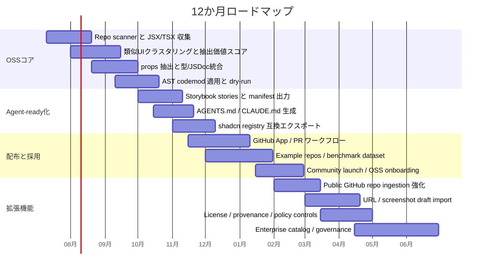

# 既存サイトと既存コードからUIコンポーネント資産を抽出するツールの競争環境とプロダクト機会

## エグゼクティブサマリー

結論から言うと、**URL/スクリーンショット起点の「見た目→コード」市場はすでに混雑している一方、既存コードベースから重複UIを見つけて“自分専用の再利用可能コンポーネント資産”に昇華し、それをAIエージェントが確実に使える形に整える市場は、まだ薄い**です。前者には Anima、Windframe、screenshot-to-code、Builder Visual Copilot、v0 などがあり、入力を画像・URL・Figma に広げつつ、React/Tailwind/HTML 等へ出力する製品が並びます。後者は Storybook、react-docgen、Glean、React Extract、jscodeshift、ts-morph のように「部分機能」は揃っているものの、**重複検出 → props抽出 → 安全な一括置換 → エージェント向けカタログ化**を一気通貫でやる製品は、主要一次資料ベースでは見当たりません。 citeturn16search4turn23search1turn14search7turn15search1turn26view0turn10search0turn11search1turn20view2turn18search1turn39search0turn39search1

したがって、あなたが狙うべき勝ち筋は、**「外部UIライブラリに依存したくない開発者向けの、repo-first なUI資産化ツール」**です。すなわち、既存コードまたは公開OSS/自社リポジトリから UI パターンを抽出し、共通コンポーネント候補と props 設計案を出し、AST ベースで安全に適用し、最終的に Storybook/manifest/AGENTS.md/CLAUDE.md まで生成する方向です。これは shadcn/ui の「Open Code」「これはコンポーネントライブラリではなく、あなたが自分のライブラリを作る方法だ」という思想と相性が良く、しかも shadcn の registry は今や**コンポーネントだけでなく project conventions や agent instructions まで配布**できます。 citeturn12search0turn13view0

MVP の優先順位は明確です。**最初にやるべきは URL クローンではなく、コードベース起点**です。理由は三つあります。第一に、URL-only では DOM と見た目は取れても、コンポーネント境界・型・既存命名・プロジェクト規約・利用中の primitives を失いやすいこと。第二に、URL クローンは著作権・利用規約・robots・スクレイピングのリスクが高いこと。第三に、repo-first なら「このUIを新規生成する」よりも「既に持っているUI資産を整理して再利用率を上げる」価値提案が明確で、AIエージェント統合も Storybook MCP、AGENTS.md、CLAUDE.md と素直につながることです。 citeturn33view0turn33view1turn34view0turn33view2turn33view3turn19view0turn35view0turn31view1turn32view0

プロダクト・ポジショニングとしては、**「外部UIライブラリを増やすツール」ではなく、「自分のコードから自分の design system を育てるツール」**が最も強いです。より具体的には、  
**“Extract, Normalize, Catalog, Instruct”**  
すなわち、  
既存 UI を抽出し、命名と props を正規化し、カタログ化し、AI エージェントが再利用できる指示系まで出す。  
この一連の流れを OSS-first で提供し、有料化は private repo 対応、クラウド差分レビュー、URL/スクショ ingestion、ポリシー/ライセンス統制、チーム向け agent governance に置くのが、最も筋が良いと考えます。これは以下の市場地図と技術地図を踏まえた分析的結論です。 citeturn20view2turn35view0turn12search2turn8search2turn31view1turn32view0

## 市場マップ

まず大きく分けると、競合は次の二群です。  
ひとつは **A: URL / スクリーンショット / Figma からコードを作る群**。  
もうひとつは **B: 既存コードベースからコンポーネント情報・カタログ・安全な変換を作る群** です。  
前者は“新しく作る”ニーズに強く、後者は“既にある資産を整理・再利用する”ニーズに強い、という構図です。一次資料を見る限り、A は充実、B は断片的です。 citeturn16search4turn15search1turn14search7turn10search0turn11search1turn20view2turn39search0turn39search1

| 名称 | 公式URL | 主入力 | 主出力 | 精度・制約 | 価格・ライセンス | 主対象ユーザー | 根拠 |
|---|---|---|---|---|---|---|---|
| Anima | `animaapp.com` / `docs.animaapp.com` | URL、Figma、画像、プロンプト | React、Vue、HTML/CSS、Tailwind、shadcn、Next.js など | URL クローンまで公式対応。強いが、生成は「code generations」課金で、website clone は法務リスクが高い。 | Free 制限あり。Enterprise は年払いで月額 $500 から。API/SDK/MCP あり。 | PM、Designer、Developer、AI platform | citeturn16search4turn16search5turn16search6turn16search14turn17view0 |
| Windframe | `windframe.dev` | スクリーンショット、Tailwind/HTML、JSX、既存 Tailwind サイト | Tailwind HTML、React/Next/Vue/Nuxt/Angular/Svelte/Astro/Solid/Rails/HTML | Tailwind-first。スクショ→コードだけでなく既存 Tailwind/JSX import と visual edit が強い。フルアプリの振る舞い抽出より UI 組み立てに強い。 | Pro $25/月、MCP $15/月など。SaaS。 | Tailwind 開発者、AI エージェント利用者 | citeturn23search1turn23search7turn23search12turn30view0 |
| screenshot-to-code | `github.com/abi/screenshot-to-code` / `screenshottocode.com` | スクリーンショット、モック、Figma、画面録画 | HTML+Tailwind、HTML+CSS、React+Tailwind、Vue+Tailwind、Bootstrap、Ionic | OSS で強い。単画面・プロトタイプ用途に強いが、既存コードベースの文脈は持たない。自己利用には API keys が必要。 | OSS は MIT。Hosted app あり。 | 個人開発者、OSS 利用者 | citeturn20view0turn22search3 |
| Builder Visual Copilot | `builder.io/figma-to-code` | Figma、既存 custom components | React/Vue/Svelte/Angular/Qwik/Solid/HTML、各種CSS方式 | 2M+ data points で学習した専用モデルと compiler/LLM の多段パイプラインを公表。component mapping が強い。ほぼ Figma 中心。 | Builder の seat/credit 課金。Free/Pro/Team/Enterprise。 | デザインシステムを持つチーム | citeturn15search0turn15search1turn29view0 |
| Locofy | `locofy.ai` | Figma、Penpot | React、HTML/CSS、Next.js、Vue、Angular、Flutter、React Native など | 対応フレームワークは広いが、公式 FAQ でも「manual refinement が必要になることが多い」と認めている。URL 起点ではない。 | SaaS、価格の詳細確認は限定的。 | Figma 中心の frontend team | citeturn24search1turn24search5turn24search10turn24search12 |
| TeleportHQ | `teleporthq.io` / `help.teleporthq.io` | Figma、プロンプト、visual builder | HTML/CSS、React、Vue、Next、Nuxt、Angular など | reusable component libraries を持つ visual builder。Figma plugin の制約が明示されている。URL 直接クローンより design-to-code 色が強い。 | 7日 trial あり。SaaS。 | Designer/Developer 混成チーム | citeturn25search0turn25search1turn25search2turn25search3 |
| v0 | `v0.app` | テキスト、画像、スクショ、手描きワイヤー、GitHub repo sync | 実コード、テンプレート、デザインシステム、デプロイ可能アプリ | 画像は “inspiration, not copy” と公式明記。repo sync 強いが、既存サイトからコンポーネント抽出する専用ツールではない。 | Free/Team/Business/Enterprise。Team $30/人/月、Business $100/人/月。 | AI-native app builder | citeturn26view0turn26view1turn28search0turn28search1 |

上の表から見えるのは、**URL-only / screenshot-only のツールは「見た目の再現」には強いが、「その人の既存コード資産に自然に溶け込む自分専用ライブラリ生成」には弱い**ということです。Builder は custom component mapping を強く打ち出していますが、それでも主戦場は Figma 起点です。Anima は URL クローンまで来ていますが、そこから repo 内の既存 primitives に再マッピングし、安全な AST 置換で全利用箇所を更新するところまでは、一次資料上は中核価値として打ち出していません。 citeturn15search0turn15search1turn16search4turn16search6turn26view0

次に、既存コードベース側です。ここはさらに断片化しています。Glean や React Extract は**手元の JSX 断片を新コンポーネントに切る**のが主目的で、Storybook は**カタログ化と AI 接続**に強く、react-docgen は**メタデータ抽出**に強く、jscodeshift / ts-morph は**安全な機械変換**に強い。しかし、**“重複UIを見つけて、候補を束ねて、props 設計し、まとめて差分適用し、AI が再利用するガイドまで出す”**統合製品は薄いです。 citeturn20view2turn18search1turn19view0turn35view0turn11search1turn39search0turn39search1

| 名称 | 公式URL | 主入力 | 主出力 | 精度・制約 | 価格・ライセンス | 主対象ユーザー | 根拠 |
|---|---|---|---|---|---|---|---|
| VSCode Glean | `github.com/wix-incubator/vscode-glean` | ローカル React/TSX コードの選択範囲 | 新コンポーネント抽出、class↔function 変換、hook 包装等 | 既存 JSX の抽出は強い。だが候補発見は手動で、リポジトリ全体の UI clustering ではない。リリースは 2021 で、保守活性は高くない。 | MIT、無償 | React 開発者 | citeturn20view2turn18search12turn18search16 |
| React Extract | `github.com/joao-mbn/react-extract` / `marketplace.visualstudio.com` | ローカル JSX/TSX の選択範囲 | 新関数コンポーネント、props/interface 自動構築 | Glean より軽量。やはり discovery は手動。抽出後の大域置換や catalog 生成はない。 | MIT、無償 | React/TS 開発者 | citeturn18search1turn37search0 |
| Storybook Autodocs | `storybook.js.org` | 既存コンポーネント + stories/MDX | UI カタログ、usage docs、自動 docs | ドキュメント化と再利用促進は非常に強い。だが重複 UI の発見・共通化自体はやらない。 | OSS、MIT、無償 | design system team | citeturn10search0turn10search4turn18search2turn38view1 |
| Storybook Manifests + MCP | `storybook.js.org/docs/ai` | 既存 Storybook | components/docs manifest、AI agent toolset、tests | AI 再利用の土台として非常に強い。現時点の docs toolset は React project 限定の preview。 | OSS 追加機能、無償 | AI-assisted UI team | citeturn19view0turn35view0turn35view1 |
| react-docgen | `github.com/reactjs/react-docgen` | React component source | 機械可読な component metadata | props 抽出・説明抽出に強いが、refactor しない。 | MIT、OSS | docgen/tooling 開発者 | citeturn11search1turn11search21 |
| Ladle | `ladle.dev` / `github.com/tajo/ladle` | 既存 React component/stories | 軽量 component workshop/index | Storybook 代替として軽い。catalog はできるが agent metadata や自動 refactor は弱い。 | MIT、OSS | 小中規模 React team | citeturn10search5turn10search19turn18search7 |
| jscodeshift | `github.com/facebook/jscodeshift` / `jscodeshift.com` | JS/TS コードベース | codemod による安全な一括書換 | AST 変換の実行基盤として強い。探索と UI 意味付けは自前実装が必要。 | OSS | migration/refactor tool authors | citeturn39search0turn39search6 |
| ts-morph | `ts-morph.com` | TypeScript/JavaScript コードベース | TS Compiler API ラッパーによる探索・操作 | 型情報を使った抽出/変換に向く。ランタイム/DOM 意味は自前。 | MIT、OSS | TS tooling authors | citeturn39search1turn39search3turn11search2 |
| AntiCopyPaster | `github.com/JetBrains-Research/anti-copy-paster` | IDE 上の copy/paste 導入直後コード | Extract Method 推奨 | “重複が入った瞬間に提案する”研究プロトタイプ。UI 特化ではないが、duplicate-to-refactor の発想源として重要。 | prototype / research | IDE refactoring research | citeturn36search1turn36search4turn36search10 |

この比較から、**あなたの直接競合は少なく、実際には“既存カテゴリのつなぎ合わせを製品化するプレイヤー”が競合**になります。つまり、  
Glean/React Extract の refactor 性、  
react-docgen/TS Compiler API の意味抽出性、  
jscodeshift/ts-morph の安全性、  
Storybook MCP の agent-ready 性、  
shadcn registry の code distribution 性。  
この五つを一体化した製品が、まだ明確な覇者を持っていません。 citeturn20view2turn11search1turn11search2turn39search0turn39search1turn35view0turn13view0

## 技術アプローチ

技術的には、A と B で最適解がかなり違います。**URL/スクショ起点は vision-to-code / DOM-to-code の問題**であり、**コードベース起点は AST / 型情報 / 重複検出 / セマンティッククラスタリングの問題**です。ここを一緒くたにすると設計が崩れます。MVP は B を中核にし、A は“参照・補助モード”に relegation するのが妥当です。 citeturn16search4turn14search7turn15search0turn39search0turn39search1

**vision-to-code 系**には少なくとも三系統あります。  
第一は screenshot-to-code のような**マルチモーダル LLM 直結型**で、画像や録画から直接 HTML/React/Tailwind などを出します。第二は Builder Visual Copilot のような**専用モデル + compiler + LLM の多段型**で、Builder は flat design structures を code hierarchies に変換する専用モデルとオープンソース compiler “Mitosis”、最後の fine-tuned LLM を組み合わせると説明しています。第三は v0 のような**画像を inspiration として使う生成型**で、これは“忠実複製”ではなく、プロジェクト文脈に合わせて再解釈する設計です。 citeturn20view0turn15search0turn26view0

そのため、A 系の精度評価は「ピクセル一致」よりも、**レイアウト骨格・レスポンシブ再構成・コードの保守性・既存設計との整合**で見るべきです。Builder は automatic responsiveness と custom component mapping を前面に出し、v0 は公式に「not a copy, it's an interpretation」と書いています。Windframe も screenshot-to-code 単独ではなく、その先の visual editor と framework export を価値にしています。換言すると、**視覚入力→即コンポーネントライブラリ化**はまだ不完全で、現実には“生成したコードをどう自分の資産へ正規化するか”が本丸です。 citeturn15search1turn26view0turn30view0

一方、**repo-first の技術基盤**はかなり明確です。  
コアは、  
1) AST で候補箇所を安定抽出し、  
2) TypeScript checker / react-docgen で props と型を取得し、  
3) 類似UIをクラスタリングし、  
4) AI が候補名・責務・props統合案を提案し、  
5) 実際の書換えは jscodeshift / ts-morph で決定的に行う、  
という分離です。Storybook も `react-docgen-typescript` は遅いが generally accurate、`react-docgen` は速いが incomplete と明言しています。この “AI は判断、AST は実行” という役割分担が、最も安全です。 citeturn11search4turn11search1turn11search2turn39search0turn39search1

**props 抽出**は、この製品の差別化点になります。react-docgen は React コンポーネント情報を機械可読形式で返すライブラリで、Storybook manifests もこれを前提に props・description・usage を JSON 化します。TypeScript Compiler API は checker を通して symbol/type/JSDoc を得られるので、  
- optional か required か、  
- literal union か、  
- default value があるか、  
- JSDoc があるか、  
を取り込めます。これにより、ただの“モジュール切り出し”ではなく、**AI agent が理解しやすい props contract** を出せます。 citeturn11search1turn11search2turn19view0

さらに重要なのは、**重複検出を単なる文字列比較にしないこと**です。AntiCopyPaster は、copy/paste された断片が本当に extract すべきかを分類モデルで判断し、F-score 0.82 を報告しています。これは UI 専用ではありませんが、「重複が見つかったら全部共通化」ではなく、「共通化価値の高い重複だけを推す」という考え方の有効性を示しています。あなたのプロダクトでも、  
- JSX 構造類似度、  
- Tailwind/className 類似度、  
- variant 差分の小ささ、  
- event handler の局所性、  
- state 依存の深さ、  
- import dependency の複雑さ、  
を特徴量にして、**抽出価値スコア**を出すのが有望です。 citeturn36search4turn36search10

技術的な要点を一言で言えば、**A は生成問題、B は正規化問題**です。市場には生成ツールが多い。したがって、あなたが取るべき余地は、**“生成されたUIまたは既存UIを、自分のコード資産へ正規化するレイヤー”**です。そこに AST・型・Storybook manifest・agent instructions をまとめると、単なる codegen ではなく “UI asset ops” に昇格します。 citeturn15search0turn19view0turn35view0turn39search0turn39search1

## ワークフロー差分

プロダクト設計では、**URL-only ingestion** と **code-based ingestion** を同一 UX にしない方がよいです。なぜなら、ユーザーが期待する成果物が違うからです。URL-only で欲しいのは「見た目の近い出発点」であり、code-based で欲しいのは「今後も再利用できる自分の資産」です。Anima の Playground は URL から working web app へ行けますし、v0 は画像や手書きワイヤーを design guide として使えます。しかし Glean や Storybook は、あくまで既存コードを整理・文書化・再利用する文脈です。 citeturn16search4turn26view0turn20view2turn35view0

| 観点 | URL / スクショ起点 | コードベース起点 | プロダクト含意 |
|---|---|---|---|
| ユーザーの期待 | まず似たUIを素早く得たい | 既存UI資産を整理・再利用したい | 入口体験を分けるべき |
| 可用な情報 | DOM/画像/見た目 | JSX/TSX、型、import、JSDoc、tests | code-first の方が高精度に意味抽出できる |
| 失われやすいもの | 命名、props、既存規約、内部 state、責務境界 | 画面完成イメージの高速取得 | A は draft、B は source-of-truth と割り切る |
| 書換え安全性 | 低い。新規生成中心 | 高い。AST で差分適用可能 | MVP は B 優先 |
| 法務リスク | 高い。サイト複製・ToS・copyright | 低い。自社 repo/許諾済み OSS が中心 | 収益化前提なら B を先に磨く |
| AIエージェント適合 | 追加の正規化が必要 | manifest / AGENTS / CLAUDE へ直結しやすい | “agent-ready catalog” は B と相性が良い |

この差分から、理想的なワークフローは二段構えです。  
**A モード**は「import / inspiration」。URL・画像・Figma から draft component を起こす。  
**B モード**は「extract / normalize」。repo を走査し、共通部品候補を見つけ、既存 primitives へ寄せ、Storybook と instructions を生成する。  
そして最終的に両方を **同じ registry / catalog / rules** に着地させる。この設計なら、A を“表層の入力チャネル”として使いながら、プロダクトの核は B に置けます。 citeturn12search2turn13view0turn19view0turn35view0

実務 UX としては、repo-first の初回オンボーディングは次のような流れがよいです。  
リポジトリ接続またはローカル CLI 起動 → コンポーネント候補の自動ランキング → 代表候補ごとに similarity cluster を表示 → AI が「共通名」「props 案」「抽出の利点/危険」を説明 → ユーザーが承認 → AST codemod 実行 → build/test/story generation → Storybook manifest / AGENTS.md / CLAUDE.md 生成。  
Storybook は agentic setup と MCP により、既存 components/docs を AI に渡す “完成形の受け皿” を既に提供しています。ここを自前でゼロから作る必要はありません。 citeturn35view1turn35view0turn19view0

逆に URL-only UX は、**最初から「component library になります」と強く約束しない方がよい**です。公式ドキュメントでも v0 は画像入力を inspiration と定義し、Windframe は screenshot-to-code の後に visual edit/export を価値にし、Anima も URL clone 後に Playground で編集・再生成・ハンドオフする流れを採っています。つまり、市場はすでに「一発で完璧ライブラリ化」ではなく、**まずたたき台、その後に正規化**という UX に寄っています。 citeturn26view0turn30view0turn16search4

## 法務・倫理とAIエージェント統合

法務面では、**URL/サイト起点機能は必ず“参照・変換・正規化”として扱い、複製を売りにしない**ことが重要です。米国著作権局は、Website や特定 web page が一定要件を満たせば登録対象になり得ると説明しており、website content のうち original expression が著作物性を持ち得るとしています。また、graphic works については複製権・翻案権・公衆表示権があると明記しています。つまり、**UI レイアウトやグラフィック的表現をそのままクローンして配布する設計は、法的なグレーが濃い**です。これは法的助言ではありませんが、製品要件として避けるべきです。 citeturn33view0turn33view1

robots.txt も重要ですが、過信は禁物です。RFC 9309 は robots exclusion protocol を crawler への要請ルールとして定義する一方、**“These rules are not a form of access authorization”** と明示しています。つまり、robots が許すから何をしてもよいわけではなく、逆に robots を無視してよいわけでもありません。製品としては、  
- robots 尊重、  
- レート制限、  
- ログイン必須 or private site の既定拒否、  
- 著作権・商標・ToS 注意表示、  
- 生成物を “reference-derived draft” として隔離出力、  
を標準にするのが妥当です。 citeturn34view0

公開 OSS リポジトリを入力にする場合は、**ライセンス継承・著作権表示・変更記録**の扱いが不可欠です。GitHub 公式は、「リポジトリを truly open source にするにはライセンスが必要」と説明し、ライセンス準拠機能も supply-chain risk の一部として位置づけています。Linux Foundation も多くの OSS ライセンスには obligations があると整理しています。したがって、public repo ingestion を売るなら、最低でも  
- LICENSE 検出、  
- file/fragment provenance 記録、  
- NOTICE/attribution 出力、  
- copyleft 警告、  
を組み込むべきです。 citeturn7search2turn7search0turn7search9

スクレイピングと API 利用についても同様です。GitHub は API Terms で abuse / excessive usage を禁じ、Acceptable Use でも scraping を定義し、個人情報の扱い・情報利用制限を定めています。自社製品でも、**「取得可能だから取得する」ではなく、「許諾された範囲で取得する」**姿勢を規約・実装の両面で固める必要があります。企業導入では、この論点が URL 起点機能の普及障壁になります。だからこそ MVP を code-first にする合理性があります。 citeturn33view2turn33view3

AI エージェント統合については、今はかなり追い風です。Storybook MCP は、agents が components/docs にアクセスし、stories 生成・tests 実行・a11y checks を回す“self-healing loop”を公式に打ち出しています。Storybook manifests は component names、descriptions、props、usage examples を JSON として出し、AI 向けに使えるよう設計されています。これは、**「agent-ready catalog」に市場の実需がある**ことを示す非常に強い証拠です。 citeturn35view0turn19view0

さらに、エージェントごとの instruction 層も整ってきました。Codex は `AGENTS.md` を作業前に読み込み、階層ごとに guidance を連結します。Claude Code は `CLAUDE.md` と `.claude/rules/` を持ち、既存の `AGENTS.md` を import するパターンも公式に案内しています。Cursor は Project / Team / User Rules と `AGENTS.md` をサポートすると説明しています。つまり、あなたの製品が出すべき成果物は、**component catalog だけでなく、agent instruction pack** でもあります。 citeturn31view1turn32view0turn8search0

この意味で、あなたの差別化は「コンポーネントを抽出する」だけでは不足です。**AI が勝手に新規UIを作らず、既存資産を使うように仕向ける instruction / manifest / registry を一緒に出す**ことが重要です。shadcn の GitHub Registries は components だけでなく project conventions や agent instructions まで配れるので、ここに接続すると配布モデルが非常にわかりやすくなります。 citeturn13view0

## 差別化とプロダクト戦略

差別化の軸は、**“better generation” ではなく “better reuse”** に置くべきです。画像からより綺麗なHTMLを出す競争は、Anima・Builder・Windframe・v0・screenshot-to-code がすでに激しいです。そこで同じ土俵に乗ると、モデル性能と credit economics の勝負に巻き込まれます。対して、repo-first で「既存 UI を資産化し、AI まで含めて再利用させる」は、現状の主要プレイヤーが断片対応に留まる領域です。これは市場空白ではなく、**市場のねじれ**です。部品はあるのに、完成品が少ない。 citeturn16search4turn30view0turn14search7turn15search1turn26view1turn20view2turn35view0

したがって、OSS-first MVP のポジショニングは次の一文に収斂します。  
**「外部UIライブラリに依存せず、既存コードから自分専用の UI コンポーネント資産を抽出し、AI エージェントが再利用しやすい形に育てるツール」**。  
この表現の強みは、  
- shadcn 的な “Open Code / own your code” の潮流に乗れること、  
- 外部依存を嫌う開発者に刺さること、  
- AI coding tool の rules / manifests / MCP 文脈に自然接続できること、  
- enterprise にも「社内 design system 整備」として売れること、  
にあります。 citeturn12search0turn13view0turn35view0turn31view1turn32view0

MVP スコープは、あえて狭くするのがよいです。最初の 3 か月は、  
**React / Next / Vite + TypeScript + JSX/TSX + Tailwind className** に絞る。  
Tailwind は className 類似度が取りやすく、shadcn ecosystem との接続も良いからです。入力はローカル repo と public GitHub repo のみ。出力は、  
- duplicated UI cluster 一覧、  
- component 候補名、  
- props 案、  
- codemod patch、  
- Storybook stories、  
- manifest、  
- `AGENTS.md` / `CLAUDE.md` ひな型、  
で十分です。URL/スクショは第2段階でよく、MVP から入れる必要はありません。 citeturn20view1turn13view0turn19view0turn35view0turn31view1turn32view0

GTM は OSS の王道が向いています。**CLI + GitHub App + Example repos** を中核にし、最初は「あなたの repo の top 20 duplicated UI を 5分で出す」体験を作るべきです。採用の鍵は、生成品質よりも**承認率と安全性**です。つまりユーザーが見る最初の価値は、  
「AI が勝手に書き換えた」ではなく、  
「これ、確かに共通化したかった」  
の納得感です。そこから one-click patch と Storybook catalog が続けば、習慣化します。 citeturn20view2turn35view1turn19view0

追うべき主要指標も、この製品では一般的な chat metrics ではありません。MVP では少なくとも、  
- 候補承認率、  
- 適用後 build/test pass 率、  
- 手戻り率、  
- 抽出後 30日以内の再利用回数、  
- 生成 manifest を agent が実際に参照した回数、  
を追うべきです。競争優位は「コードを一度出した」ことではなく、**その後も人間と AI が同じ資産を繰り返し使う**ことにあります。これは Storybook MCP が狙う価値と一致しています。 citeturn35view0turn19view0

マネタイズは三層が妥当です。OSS コアは無償で、  
第一層は private repo / team collaboration / cloud diff review / managed UI catalog。  
第二層は policy pack と license/provenance 管理。  
第三層は URL・スクショ・Figma ingestion の credit-based 追加機能。  
この順番なら、最初から credit business に依存せず、**repo-first の信頼を先に獲得**できます。URL クローン課金は魅力的に見えますが、法務と品質のリスクを考えると、後ろに置く方が賢明です。 citeturn33view0turn33view2turn17view0turn30view0

## リスクとロードマップ

実装リスクは大きく五つあります。  
第一に、**誤った共通化**です。似て見える JSX を一つにすると、責務まで混ざって props 地獄になる危険があります。対策は、抽出価値スコアと human approval を必須にし、AI が props を提案しても AST 適用前に説明責任を果たすことです。AntiCopyPaster のように「検出」と「推奨」を分ける発想が有効です。 citeturn36search1turn36search4turn36search10

第二に、**型・props 抽出の不完全性**です。Storybook 自身が `react-docgen-typescript` は遅いが generally accurate、`react-docgen` は faster but incomplete と整理しています。対策は、初回スキャンは高速ヒューリスティック、確定時に TS checker で精査、という二段階にすることです。 citeturn11search4turn19view0

第三に、**コード書換えの破壊性**です。これに対しては jscodeshift や ts-morph のような AST ベース実行を採用し、dry-run・snapshot・test gate・PR 生成を標準にすべきです。文字列置換や LLM 直書換えを主経路にすると、再現性が落ちます。 citeturn39search0turn39search1

第四に、**URL/スクショ ingestion の法務・ブランド毀損**です。対策は、MVP では切る。後から入れる場合も、robots 尊重、login/private site 禁止、商標/著作権警告、provenance 記録、公開配布の抑制を前提にすることです。 citeturn34view0turn33view0turn33view1turn33view2

第五に、**AI エージェントがせっかく作った資産を使ってくれない問題**です。これは実は最重要です。対策は、Storybook manifests/MCP、`AGENTS.md`、`CLAUDE.md`、Cursor rules を同時に生成し、「使うべき components」「使ってはいけない patterns」「先に docs を引く方法」まで instructions として埋め込むことです。Storybook 公式も AGENTS.md への具体的な指示例を出しています。 citeturn35view0turn31view1turn32view0turn8search0

優先ロードマップは、次の順が合理的です。

このロードマップでの MVP 完成条件は、**ローカルまたは public repo を入力すると、重複UI候補が並び、1件以上を安全に共通コンポーネントへ昇格させ、Storybook 上で文書化し、AI agent がその部品を再利用できる状態まで自動で整う**ことです。ここまで行けば、単なる refactor 補助ではなく、“UI 資産運用”の最小成立単位になります。 citeturn35view0turn19view0turn13view0turn31view1turn32view0

未解決論点として残るのは三つです。  
ひとつは、**React/Tailwind 以外への初期対応範囲**。市場的にはまず React で十分ですが、Vue/Svelte の要望は早めに来るはずです。  
ふたつめは、**デザイン差分が大きい近縁UIをどこまで同一候補として扱うか**。ここは scoring と human-in-the-loop の設計が肝になります。  
みっつめは、**URL/スクショ ingestion をどの時点で商用化するか**。魅力は大きい一方で、法務・品質・ブランドの負債も大きいので、repo-first の traction を固めてから入れるのが安全です。これらは今後の評価設計次第ですが、少なくとも現時点の競争環境では、**最初に勝つべき戦場は code-first** です。 citeturn16search4turn30view0turn35view1turn33view0turn34view0